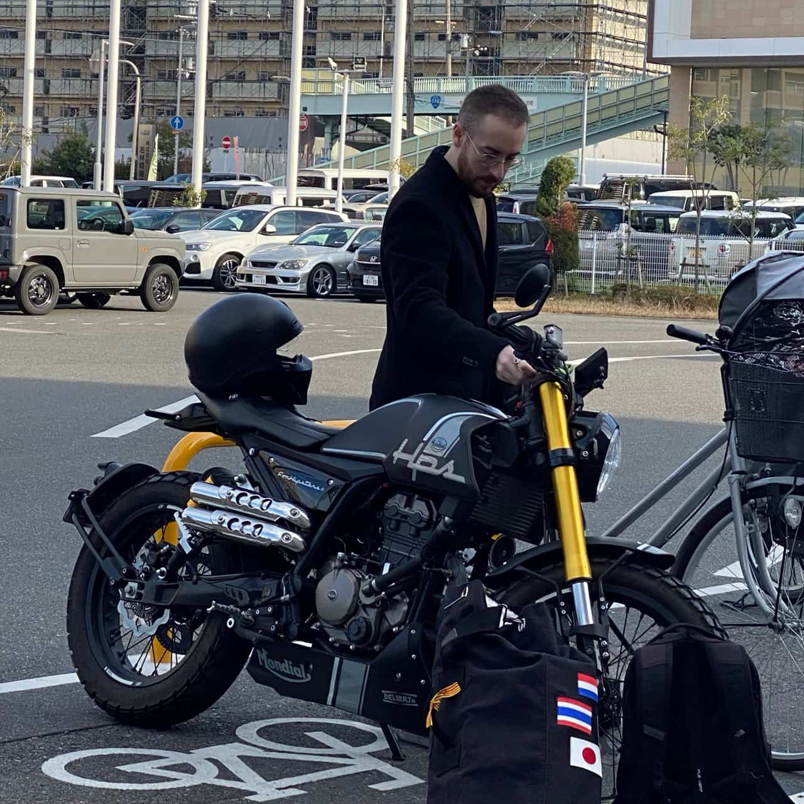

Jorge (ホルへ) Chato Astrain
---
<!-- column_layout: [2, 1] -->
<!-- column: 0 -->

* **Email** (work@jorgechato.com)
* [Main page](https://jorgechato.com)
* [Github](https://github.com/jorgechato)
* [Linkedin](https://www.linkedin.com/in/jorgechato/)
* [Where I am Today](https://whereisjorge.today/)
* [How to work with me?](https://x.jrg.tools/6IsFTc)

[How to pronounce my name?](https://x.jrg.tools/Rs9oBE)
<!-- column: 1 -->
Over a **decade** crafting code.
# Senior BE - Mercari
* Cross border team
* Identity Platform team
# Senior BE - Virtusize
* Event Streaming team
* BE team
# SRE - Adidas
* Kafka team
* Platform team
* R&D team
# FE - Dashmote

<!-- reset_layout -->
# Currently living in Osaka

In **Japan** since *2022*.

<!-- pause -->
I lived in:
* Zaragoza
<!-- pause -->
* Amsterdam
<!-- pause -->
* Seoul
<!-- pause -->
* Tokyo
<!-- end_slide -->
My interests
---
<!-- column_layout: [1, 1] -->
<!-- column: 0 -->
# Books
## My favourite books

* **Surely You're Joking, Mr. Feynman!** *by Richard P. Feynman*
* **The Art of War** *by Sun Tzu*
* **The Wise Man’s Fear** *by Patrick Rothfuss*
* **The Blinding Knife** *by Brent Weeks*

https://x.jrg.tools/bHbtAb

## My latest reading

**Africanus trilogy** *by Santiago Posteguillo*

1. Africanus: Son of the Consul
2. The Accursed Legions
3. The Betrayal of Rome (currently reading)

<!-- column: 1 -->
# Motorcycles
I drove motorcycles across **4 (very different) countries**.

This is my current **toy in Japan**.

# My recent project
I'm working on a multiplatform app for **Storing my family heritage**.
<!-- pause -->
## Stack
* Tauri **Rust**
* React **Typescript**
* Turso **SQLite**
* Custom WebAuth **NextJs**

Targeting `iOS`, `macOS`, `Windows` and `Linux`.
<!-- end_slide -->
https://x.jrg.tools/BPZRQZ
---

<!-- pause -->
I know what You are thinking, "How the F\*\*K did He make a presentation in the terminal?" — **And that's a secret**
